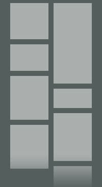

# masonry-view
This demo project is in objective-c for creating a masonry view using the images actual resolution. Images height is calculated before download and custom view has been created. Have a look!

   

